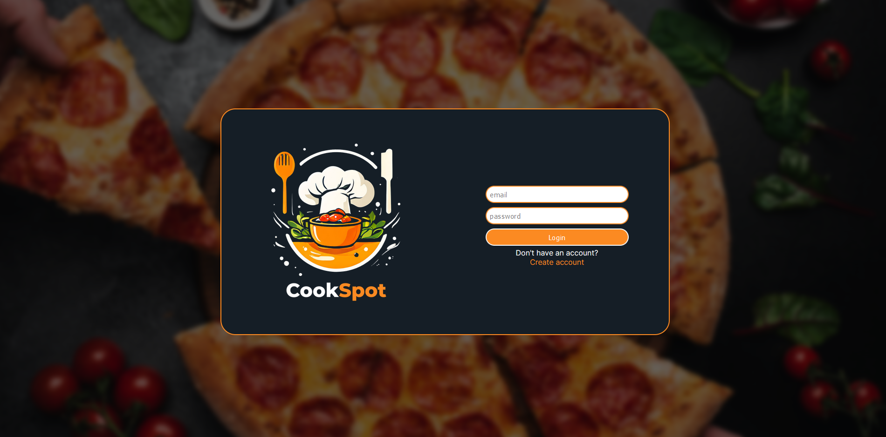

# CookSpot

Welcome to CookSpot, the web app for all your culinary adventures! Whether you're an amateur home cook or a seasoned chef, CookSpot is designed to cater to your every cooking need.

# Table of Contents

1. [Features](#features)
2. [Technology Stack](#technology-stack)
3. [Database Design and Structure](#database-design-and-structure)
4. [Design Patterns](#design-patterns)
5. [Installation](#installation)
6. [Usage Preview](#usage-preview)

## Features

- **User Management:** Users can create accounts, log in, and manage their profiles, including changing their username, email, and password.
- **Recipe Management:** Users can create, view, and edit recipe posts. Each recipe can be categorized and rated.
- **Exploration:** Users can explore new and trending recipes.
- **Administrative Features:** Admins can manage the application.
- **Error Handling:** The application has error handling mechanisms to provide feedback when something goes wrong.
- **Responsive Design:** Platform is fully responsive, making it easy to navigate on various devices.

## Technology Stack

Project is built using a variety of technologies and tools to ensure efficiency, performance, and scalability. Below is a list of the key components:

1. **Front-End:**
   - React.js: A JavaScript library for building user interfaces, used for structuring, styling, and handling client-side logic.
   - CSS: For styling the application components.
   - JavaScript (ES6+): For client-side interactivity and logic.

2. **Back-End:**
   - Spring Boot: The primary framework for building the back-end, providing a robust, production-ready environment for developing RESTful APIs.
   - PostgreSQL: A reliable and scalable relational database management system for storing application data.
   - Swagger: For API documentation and testing, integrated into the Spring Boot back-end to automatically generate interactive API docs.

3. **Containerization:**
   - Docker: For creating, deploying, and running applications in containers.
   - Docker Compose: For defining and running multi-container Docker applications.

4. **Version Control:**
   - Git: For source code management.
   - GitHub: For hosting the repository and facilitating version control and collaboration.

## Database Design and Structure

The project includes a comprehensive design and structure for the database, ensuring efficient data storage and retrieval. Here are the key components:

1. **Entity-Relationship Diagram (ERD):**
   - The `erd.png` file in the main directory provides a visual representation of the database schema. This diagram is useful for understanding the relationships between different entities in the database.l

2. **Database Schema:**
   - The `Database_dump.sql` file contains the SQL commands to create the database structure with testing data.
   - [View Database_dump Script](./Database_dump.sql)
     

## Design patterns

1. **MVC (Model-View-Controller)**
   - Separates the application into Model, View, and Controller components.
   - **Example**: [models/Post.php](.src/models/Post.php), [views/shared/display-post.php](./public/views/shared/display-post.php), [controllers/PostController.php](src/controllers/PostController.php)
2. **Repository**
   - Abstracts the data layer, providing a modular structure.
   - **Example**: [PostRepository.php](./src/repository/PostRepository.php)

3. **Template Method**
   - Defines the skeleton of an algorithm in a method, deferring some steps to subclasses.
   - **Example**: [form-controller.js](./public/js/search.js.#L32)
   

## Installation

Project is dockerized for easy setup and deployment. Follow these steps to get the project up and running:

1. **Clone the Repository**
2. **Ensure Required Dependencies Are Installed**
Make sure you have the following installed on your system:
    -Docker
    -Docker Compose
    -Node.js & npm (for running the React frontend)
    -Java 17+ (for running the Spring Boot backend)
3. **Set Up and Run the Application**
   
   >Start Database and Nginx using Docker

In the project directory, run:

      docker-compose up -d

This will start:
   -PostgreSQL database
   -Nginx reverse proxy
> Start the Spring Boot Backend
   Navigate to the backend directory and start the server:

      cd backend
      ./mvnw spring-boot:run  # On macOS/Linux
      mvnw.cmd spring-boot:run  # On Windows

The backend will run at: http://localhost:8080

   
> Start the React Frontend
Navigate to the frontend directory and start the React app:

      cd frontend
      npm install  # Install dependencies
      npm start

The frontend will run at: http://localhost:3000
   
4. **Access the Application**
   Once all services are running:

    - Open http://localhost:3000 to use the application.
    - Open http://localhost:8080/swagger-ui.html to access the Swagger API documentation.

This setup ensures that the database and reverse proxy are containerized with Docker, while the backend (Spring Boot) and frontend (React) run as separate services.

## Usage Preview
### Login Page

Desktop | Mobile
:-------------------------:|:-------------------------:
  |  

### Main Page

Desktop | Mobile
:-------------------------:|:-------------------------:
  |  

### Categories Page

Desktop | Mobile
:-------------------------:|:-------------------------:
  |  

### Post Page

Desktop | Mobile
:-------------------------:|:-------------------------:
  |  

